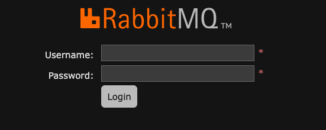
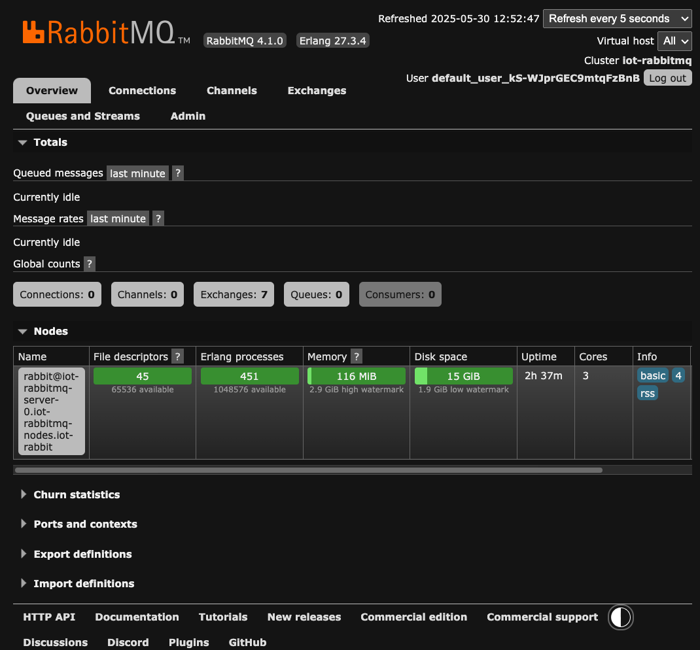

# Rabbit MQ test

## Table of Contents
[Result](#result)

[Motivation](#motivation)
[Overview](#overview)

---
## Motivation

We tested a setup with  moquitto, kafka, and neo4j in [the previous repo](https://github.com/megnergit/mqtt-neo4j-streaming-m1). 

The choice of kafka is a requirement to use the official kafka-connect to stream data to neo4j.
However, we ended up with a non-elegant solution with hand-made shell script to monitor kafka sink connector. 


Here we will try on Rabbit MQ to do the same. The advantage of Rabbit MQ is

- It has queue inside. Therefore does not require kafka in principle.

The disadvantage would be

- It is a push-based subscription. Rabbit MQ IS fast, but not as fast as kafka that is a pull-based subscription. 

---
## Overview

We will start from the place we ended in the last repository, which means,

- kuberentes (microk8s) is already running on a VM in my laptop.
- docker is already running on Raspberry Pi.
- neo4j is already running as a docker container on Raspberry Pi.


0. Stop Kafka experiment
1. Deploy RabbitMQ Cluster Operator on kubernetes
2. Create a RabbitMQ cluster 
3. Add NodePort to access from local
4. Write IoT device simulator in Java

For this entire experiments ChatGPT helped me a lot. 
---
## Procedure

### 0. Stop Kafka experiment

Currently we are running an experiment with Kafka, where mosquitto uses
the port 1883. The container port is connected NodePort 31883,
therefor it is not necessary to stop mosquitto.

Nevertheless, I expect that I will mix it up with the port 1883 that
RabbitMQ cluster will use during the following
experiment.

Therefore we want to stop mosquitto, but in the way we can restart it
when necessary.

```sh
$ k get deployment -n iot-lab
NAME            READY   UP-TO-DATE   AVAILABLE   AGE
kafka           1/1     1            1           23d
kafka-connect   1/1     1            1           21d
mosquitto       1/1     1            1           22d

$ k scale deployment mosquitto --replicas=0 -n iot-lab
deployment.apps/mosquitto scaled
```

Check if no mosquitto pods are running.
```sh
$ k get po -n iot-lab
... 
```
All right. 

To restart the experiment, 

```sh
$ k scale deployment mosquitto --replicas=1 -n iot-lab
```

### 1. Deploy RabbitMQ Cluster Operator on kubernetes

Cluster Operator will prepare the deployment of RabbitMQ cluster.
Cluster Operator will 

- provide Custome Resource Definision (=CRD, the blueprint of a Rabbit cluser), "RabbitmqCluter".
- monitor the creation of a cluster
- when it detected a new cluster, Operator create  PVC, Service, etc.


Use RabbitMQ official manifest file. It automatically create the namespace ```rabbitmq-system```.

```sh
kubectl apply -f https://github.com/rabbitmq/cluster-operator/releases/latest/download/cluster-operator.yml

```

Check.

```sh

$ k get ns
NAME               STATUS   AGE
default            Active   105d
iot-lab            Active   24d
kube-node-lease    Active   105d
kube-public        Active   105d
kube-system        Active   105d
longhorn-system    Active   102d
postgres-cluster   Active   104d
rabbitmq-system    Active   17s

$ k config set-context --current --namespace rabbitmq-system
Context "microk8s" modified.

$ k get po
NAME                                         READY   STATUS    RESTARTS   AGE
rabbitmq-cluster-operator-66f8464ddd-p7vwj   1/1     Running   0          63s
```

All right.

---
### 2. Create a RabbitMQ cluster

Create a namespace ```iot-rabbit```.

```sh
$ k create ns iot-rabbit
namespace/iot-rabbit created
$ k get ns
NAME               STATUS   AGE
default            Active   105d
...
iot-rabbit         Active   2s
...
rabbitmq-system    Active   19m
...
```

Write the cluster manifest.

```
$ tree . -L 2
.
├── iot-consumer
│   ├── HELP.md
│   ├── IotConsumerApplication.java
│   ├── mvnw
│   ├── mvnw.cmd
│   ├── pom.xml
│   └── src
├── iot-simulator
│   ├── HELP.md
│   ├── IotSimulatorApplication.java
│   ├── mvnw
│   ├── mvnw.cmd
│   ├── pom.xml
│   └── src
├── k8s
│   └── rabbitm1-cluster.yaml   # <- Here
└── README.md
```

Make sure to **inject MQTT plugin**.

```yaml 
# k8s/rabbitmq-cluster.yaml
apiVersion: rabbitmq.com/v1beta1
kind: RabbitmqCluster
metadata:
  name: iot-rabbitmq
  namespace: iot-rabbit
spec:
  replicas: 1
  resources:
    requests:
      memory: 256Mi
      cpu: 250m
  persistence:
    storage: 1Gi
  rabbitmq:
    additionalPlugins:
      - rabbitmq_mqtt    # <-- Here to inject the plugin
    additionalConfig: |
      mqtt.listeners.tcp.default = 1883
      mqtt.allow_anonymous = true
```

This enables RabbitMQ to receive MQTT message.
The default protocol of RabbitMQ is AMQP.

Apply the manifest file.
```sh
$ k apply -f k8s/rabbitm1-cluster.yaml
rabbitmqcluster.rabbitmq.com/iot-rabbitmq created
```
Check it.
```sh
$ k get po -w -n iot-rabbit
NAME                    READY   STATUS     RESTARTS   AGE
iot-rabbitmq-server-0   0/1     Init:0/1   0          52s
iot-rabbitmq-server-0   0/1     PodInitializing   0          64s
iot-rabbitmq-server-0   0/1     Running           0          65s
iot-rabbitmq-server-0   1/1     Running           0          82s
```

Great.

### 3. Add NodePort to access from local
By default management plugin (= Web UI) is enabled. One can
access the web UI via port 15672. Connect the port of the VM
to local (=your laptop) executing the following on the VM, 

```sh
kubectl port-forward svc/iot-rabbitmq 15672:15672 -n iot-lab
```

... and connect to localhost:17672 on the laptop.


Alternatively we will do the following to convert
ClusterIP to NodePort so that we can use
VirtualBox UI to perform port forwarding,
as it is troublesome to execute kubectl port-forward
everytime we accidentaly terminate the command line.


Services that RabbitMQ uses are following. 

$ k get svc
NAME                 TYPE        CLUSTER-IP       EXTERNAL-IP   PORT(S)                                 AGE
iot-rabbitmq         ClusterIP   10.152.183.191   <none>        5672/TCP,15672/TCP,1883/TCP,15692/TCP   85m
iot-rabbitmq-nodes   ClusterIP   None             <none>        4369/TCP,25672/TCP                      85m

We will change the service type of ```iot-rabbitmq``` from ClusterIP to NodePort so that
we can access them from the host machine (= the laptop).

```iot-rabbitmq-nodes``` does not require external access, as it is for DNS purpose only
so that different RabbitMQ clutsers can talk each other.

```sh

k get svc iot-rabbitmq -o yaml > k8s/iot-rabbitmq-svc-nodeport.yaml

```

Edit the file as it is instructed inside the file in this repo. 

```yaml
...
  name: iot-rabbitmq-np # <- change name
...
  ports:
    - appProtocol: amqp
      name: amqp
      port: 5672
      protocol: TCP
      targetPort: 5672
      nodePort: 31572 # <- add here
    - appProtocol: http
      name: management
      port: 15672
      protocol: TCP
      targetPort: 15672
      nodePort: 31672 # <- add here
    - appProtocol: mqtt
      name: mqtt
      port: 1883
      protocol: TCP
      targetPort: 1883
      nodePort: 30883 # <- add here
    - appProtocol: prometheus.io/metrics
      name: prometheus
      port: 15692
      protocol: TCP
      targetPort: 15692
      nodePort: 31692 # <- add here
  selector:
    app.kubernetes.io/name: iot-rabbitmq
  sessionAffinity: None
  #  type: ClusterIP # Change here
  type: NodePort # <- add here
```
Then apply the new manifest

```sh
k apply -f k8s/iot-rabbitmq-svc-nodeport.yaml
```

Check it.

```sh
$ k get svc
NAME                 TYPE        CLUSTER-IP       EXTERNAL-IP   PORT(S)                                                         AGE
iot-rabbitmq         ClusterIP   10.152.183.223   <none>        5672/TCP,15672/TCP,1883/TCP,15692/TCP                           3m37s
iot-rabbitmq-nodes   ClusterIP   None             <none>        4369/TCP,25672/TCP                                              136m
iot-rabbitmq-np      NodePort    10.152.183.191   <none>        5672:31572/TCP,15672:31672/TCP,1883:30883/TCP,15692:31692/TCP   3s
```

(Port Mapping)

| NodePort | RabbitMQ Port | Purpose               | Protocol |
|----------|----------------|------------------------|----------|
| 30883    | 1883           | MQTT (IoT devices)     | MQTT     |
| 31572    | 5672           | AMQP (Java clients)    | AMQP     |
| 31672    | 15672          | Management UI (HTTP)   | HTTP     |
| 31692    | 15692          | Prometheus Metrics     | HTTP     |


Then, we will add port forwarding to VM configuration. We need three ports.


Then, open ```localhost:31672``` on the host. 



All right. The username  and the password fot the initial log in
is stored in the secret. 
```sh
$ k get secrets
NAME                         TYPE     DATA   AGE
iot-rabbitmq-default-user    Opaque   9      155m
iot-rabbitmq-erlang-cookie   Opaque   1      155m

$ k get secrets iot-rabbitmq-default-user -o yaml
```


Great. 

---
### 4. Write IoT device simulator in Java

We will do two things here. 

- Add paho dependency to pom.xml
- Write IotSimulatorApplication.java

A quick fix to directory names. 
As package names like com.example.iot_simulator is not best practice, 
we will remove the underscore. 

```sh
com.example.iot_simulator  -> com.example.iotsimulator 
```

We will rename the directories accordingly. 

We are going to work at iot-simulator below. 

```sh
$ tree . -L 2
.
├── images
│   ├── port-forwarding-1.png
│   ├── rabbit-loggedin-1.png
│   └── rabbit-ui-1.png
├── iotconsumer
│   ├── HELP.md
│   ├── mvnw
│   ├── mvnw.cmd
│   ├── pom.xml
│   └── src
├── iotsimulator
│   ├── HELP.md
│   ├── mvnw
│   ├── mvnw.cmd
│   ├── pom.xml
│   └── src
├── k8s
│   ├── iot-rabbitmq-svc-nodeport.yaml
│   └── rabbitmq-cluster.yaml
├── RABBIT_MQ_TEST
└── README.md

```


We will add the following to pom.xml

```sh
<dependencies>
  <!-- MQTT client -->
  <dependency>
    <groupId>org.eclipse.paho</groupId>
    <artifactId>org.eclipse.paho.client.mqttv3</artifactId>
    <version>1.2.5</version>
  </dependency>
</dependencies>
```

Then write 

<!--
0. Stop Kafka experiment
1. Deploy RabbitMQ Cluster Operator on kubernetes
2. Create a RabbitMQ cluster 
3. Add NodePort to access from local
4. Write IoT device simulator in Java
-->

---

# END
---
